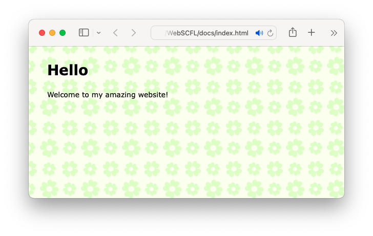

[](https://)
[](https://)

# WebSFCL 🌎

WebSCFL stands for *Web Sectioned Command First Language*. It's a programming language
designed to make simple [Prof. Dr. Style](http://contemporary-home-computing.org/prof-dr-style/)
websites. The websites can be later customized further configured using CSS. I designed it
because I always end up fighting against CSS and changing the style of my sites and I'd like
to actually focus on the content instead of the styling.

For examples of websites created with WebSFCL check:
- [Lartu.net](https://www.lartu.net) ([source](https://github.com/lartu/lartu.github.io))
- [Optativa](https://optativa.github.io) ([source](https://github.com/optativa/optativa.github.io))

## Usage

WebSCFL is especially tailored to creating GitHub Pages and, as such, it compiles your website into a `docs` directory,
so you can have both the source for your site and your site in the same repository without having to redeploy anything.

### Directory Setup

WebSCFL expects the project directory to be configured with four foulders, an optional folder, and the WebSCFL build
file:

```
/images
/include
/other
/src
/files [optional]
scfl_build.py
```

Each folder plays a different role in building your webpage.
- The `src` folder should only contain `.scfl` files. A file called `x.scfl` will be compiled to `x.html` when building your webpage.
- The `images` folder should include the images you'll use in your `.scfl` files. WebSCFL only looks for images in this directory and only copies the images that are actually used to the final built webpage.
- The `include` folder may include your stylesheet file and any other `.html` files you want to include verbatim into your built pages using the `INCLUDE` command.
- The `other` folder includes files used by WebSCFL when compiling your webpage. You might edit them, but make sure not to remove any of these files.
- Optionally, you may add a `files` folder. The `files` folder, if found, is always copied into the `docs` directory when the site is compiled.

:warning: Bear in mind that as WebSCFL compiles your website into a newly created `docs` directory, should a `docs` folder already exist in the project directory, it will be deleted!

## WebSCFL Files
WebSCFL turns `.scfl` files into `.html` files that can be displayed on your browser.
Any `.scfl` files that you want to include in your webpage must be added to the `src` folder.
Basic `.scfl` files must contain two sections, a HEAD and a BODY:

```
HEAD:
...

BODY:
...

```

Each section accepts different commands. A command is a word written in a line, followed by
a linespace and any arguments the command might accept. If a command accepts multiple arguments,
they must be separated using a `,` character. For example:

```
PAGETITLE My wonderful site!
```

Will set the title displayed by the browser when visiting that page to *My wonderful site!*.

## Example WebSCFL Page
Here's a very basic example WebSCFL page.

```
HEAD:
PAGETITLE    My amazing website!
DESCRIPTION  This is my amazing website.
BACKGROUND   pagebackground.png
STYLE        style.css

BODY:
TITLE        Hello
WRITE        Welcome to my amazing website!
LINK         Visit Github!, https://github.com/

```

That will generate a website that looks like this (depending, obviously on the contents
of your stylesheet file (in this case `style.css`, to be found in the `include` folder):



## WebSCFL Commands

This section lists the commands that can be used in each section, along with their arguments.

### HEAD Section Commands
These commands must be in the section defined by the `HEAD:` section separator.

- `PAGETITLE`
   - Sets the title of the page to be displayed by the browser when visiting it.
   - Example: `PAGETITLE my great page`
- `DESCRIPTION`
   - Sets the description of your website, to be displayed by, for example, search engines.
   - Example: `DESCRIPTION this site contains all my amazing stuff`
- `STYLE`
   - Sets the stylesheet file for the page. The file is expected to be found in the `include` folder.
   - Example: `STYLE mystyles.css`
- `BACKGROUND`
   - Sets the tiled page background image. The image is expected to be found in the `images` folder.
   - Example: `BACKGROUND mybackground.gif`

### BODY Section Commands
These commands must be in the section defined by the `BODY:` section separator.

- `TITLE`
   - Adds big title text to the page.
   - Example: `TITLE Welcome!`
- `HEADER`
   - Adds mid title text to the page.
   - Example: `HEADER A section!`
- `SUBHEADER`
   - Adds small title text to the page.
   - Example: `SUBHEADER A section within a section!`
- `WRITE`
   - Adds text to the page. Text added is appended to previous text added using `WRITE` unless another element such as an image or a break have been added in the middle.
   - Example: `WRITE Welcome to my website! Here you'll find amazing stuff!`
- `LINK`
   - Adds a link to another website or page within your site. Optionally, you can specify some text to be appended to the link (but not to be a link) immediately after it.
      - Example for a link without appended text: `LINK Google, https://www.google.com`
      - Example for a link to another page within your site: `LINK About Me, about.html`
      - Example for a link with appended text: `LINK Google, https://www.google.com, ; the famous search engine.`
   - Alternatively, instead of `,` to separate parameters, you can use `||`.
   - In the `LINK` command, the `&com;` string is replaced by a `,` in the resulting line.
   - In the `LINK` command, the `&doublepipe;` string is replaced by a `||` in the resulting line.
- `IMAGE`
   - Adds an image to your page. The image will be displayed on its own line. Optionally, you can specify any CSS classes to be used to style this image. These classes should be defined within your used stylesheet file.
   - Example without CSS styling: `IMAGE mypicture.png`
   - Example with CSS styling: `IMAGE mypicture.png, bigpicture, shadowed`
- `LINKIMAGE`
   - Adds an image to your page that, when clicked, will take the user to another page or website. Optionally, you can specify any CSS classes to be used to style this image. These classes should be defined within your used stylesheet file.
   - Example without CSS styling: `LINKIMAGE lartu.png, https://www.lartu.net/`
- `FOOTNOTE`
   - Adds small text to your page. This text is displayed on its own and it's used to add notes to paragraphs or footers to images.
   - Example: `FOOTNOTE This is a picture of me at the beach.`
- `BREAK`
   - Adds spacing to break text added via `WRITE` into paragraphs.
   - Example: `BREAK`
- `LISTITEM`
   - Adds a bulleted list element to the page.
   - Example: `LISTITEM element1`
   - Example: `LISTITEM element2`
   - Example: `LISTITEM element3`
- `NEWLINE`
   - Adds a line break to the text added via `WRITE`. Unlike `BREAK`, `NEWLINE` doesn't
   leave any whitespace between lines.
   - Example: `NEWLINE`
- `COMPILENOTE`
   - Adds a small note indicating when and how the page was compiled.
   - Example: `COMPILENOTE`

### Any Section Commands
- `INCLUDE`
   - Copies the contents of another file verbatim into the generated `.html` file. The other file is expected to be foun in the `include` folder.
   - Example: `INCLUDE somecontent.html`
- `COPY`
   - Copies a file from a directory to a path in the `docs` (build) directory.
   - Example: `COPY awonderfulapp.exe, downloads/awonderfulapp.exe`
- `COPYDIR`
   - Copies a directory to a path in the `docs` (build) directory.
   - Example: `COPYDIR documents/mypresentation, presentation`

### A Note About Links

In all commands you can use the shorthand forms to insert a link:
- `[[https://destination Link Text]]`
- `[[Link Text || https://destination]]`

For example:

```
LISTITEM    This list item contains a [[Link || https://github.com/lartu]]!
WRITE       This paragraph [[https://lartu.net does too]], isn't that great?
```

If you need to display the `||` characters within a shorthand link, use `&doublepipe;` instead.

# License
WebSCFL is released under the Apache 2 license. Copyright © Lartu, 2024.
